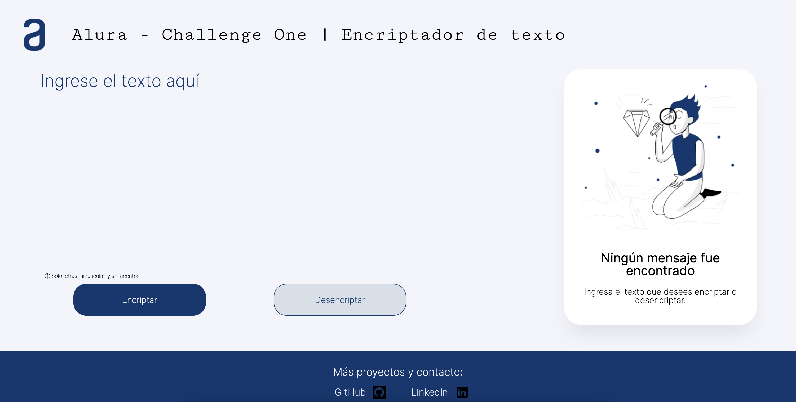
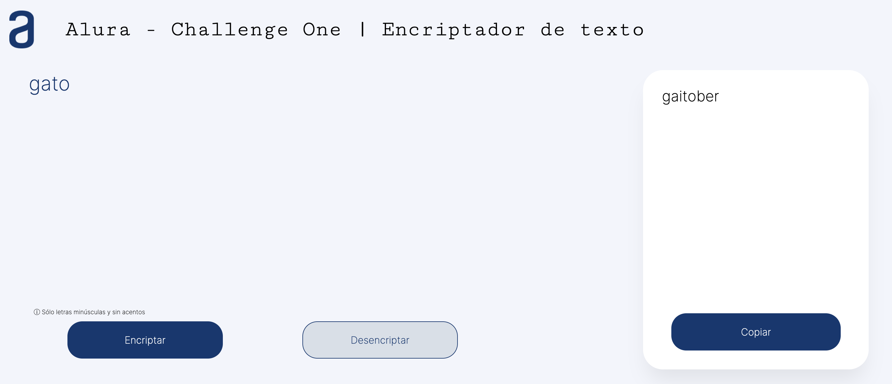
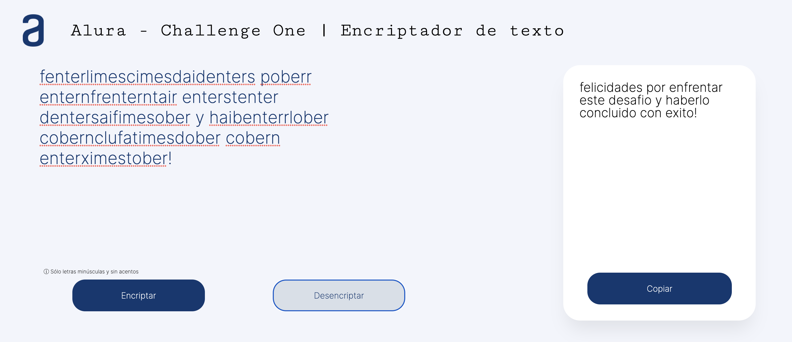
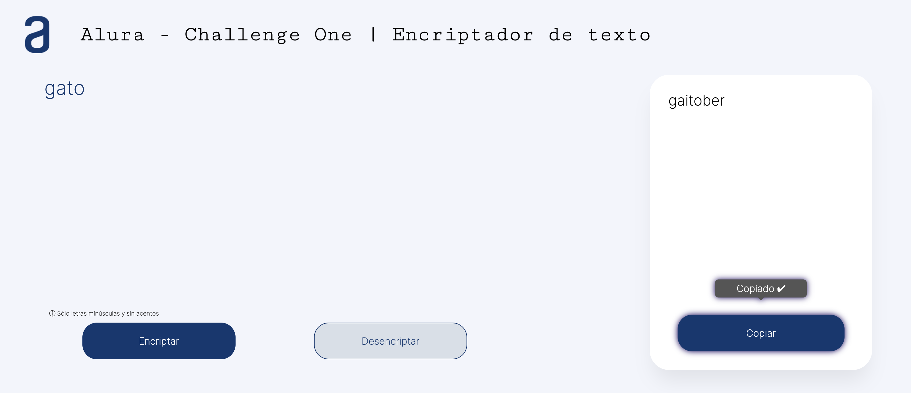
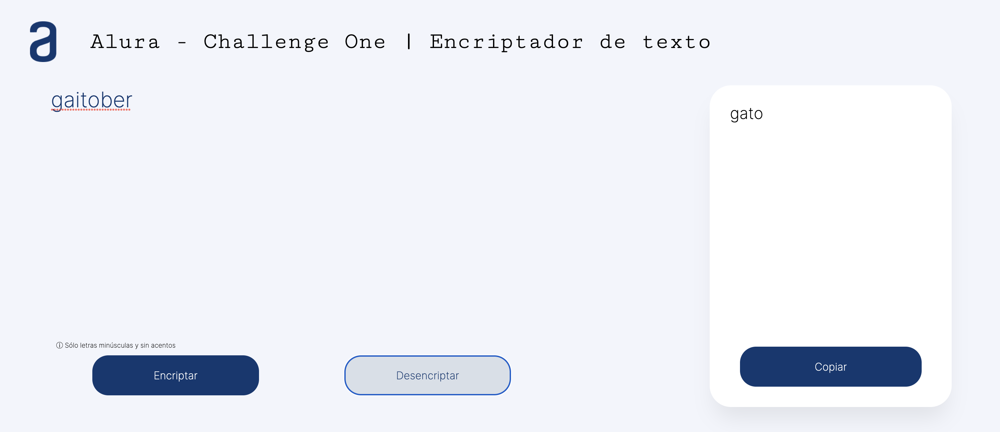

# ALURA Challenge One | Encriptador

 Realizado con  
 
 
 

## Requisitos

> - Debe funcionar solo con letras minúsculas
> - No deben ser utilizados letras con acentos ni caracteres especiales
> - Debe ser posible convertir una palabra para la versión encriptada también devolver una palabra encriptada para su versión original. 

## Funcionamiento

  

[Live Demo](https://ustehkenny.github.io/challenge-one-encriptador/)

Dado un texto, se intercambiarán las siguientes letras al encriptar:

`La letra "e" es convertida para "enter"`  
`La letra "i" es convertida para "imes"`  
`La letra "a" es convertida para "ai"`  
`La letra "o" es convertida para "ober"`  
`La letra "u" es convertida para "ufat"`  

Y viceversa para desencriptar.

### Ejemplo

Al ingresar *gato* deberá de regresar *gaitober*

  

También se puede realizar el proceso inverso, ya sea que se copie directamente el texto del resultado anterior o desencriptar un mensaje realizado por el usuario.

  

  

  

